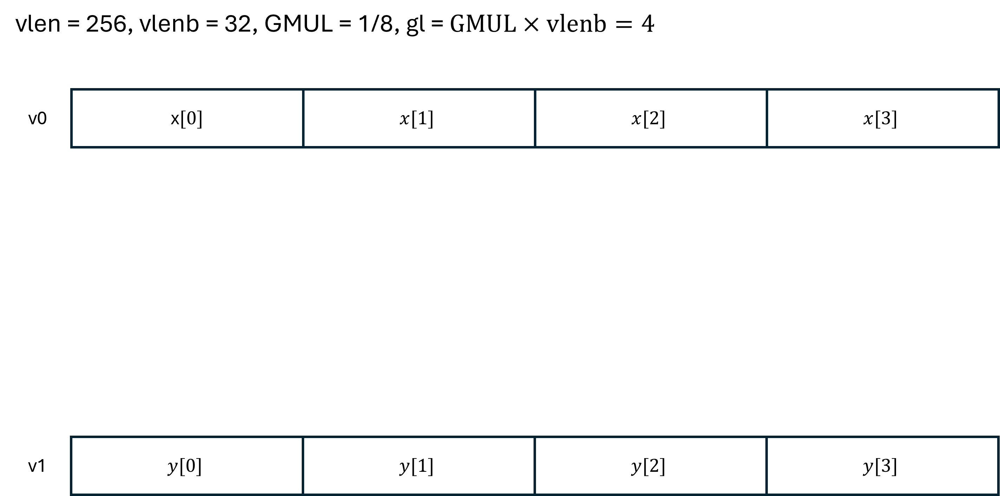

# A strawman for 64-bit vector encoding

### 32-bit vv-encoding for vector arithmetic instructions (size of field in bits)

| major   (7) | vd   (5) | variant   (3) | vs1   (5) | vs2   (5) | vm   (1) | function   (6) |
|----------------|-------------|------------------|--------------|--------------|-------------|-------------------|          
| 0x57           |  $0:31$     | $0:7$            | $0:31$       | $0:31$       | $0:1$       | $0:63$              |

### 64-bit vv-encoding for vector arithmetic instructions (size of field in bits)

| major   (7) | vd   (8) | variant   (3) | vs1   (8) | vs2   (8) | vm   (3) | polarity   (1) | vd type   (2) | vs1 type   (2) | vs2 type   (2) | GMUL   (3) | vtma   (2) | vrnd   (2) |function   (6)                 | suffix   (7) | 
|----------------|-------------|------------------|--------------|--------------|-------------|-------------------|------------------|-------------------|-------------------|---------------|---------------|---------------|----------------------------------|-----------------|          
| 0x57           |  $0:255$    | $0:7$            | $0:255$      | $0:255$      | $0:7$       | $0:1$             | $0:3$            | $0:3$             | $0:3$             | $0:7$         | $0:3$         | $0:3$         | bbbnnn   ${\sf nnn} \neq 111$ | 1111111         |

### Summary of encoding format changes

The additional 32 bits of space in a 64-bit encoding are consumed as follows:

| bits       | usage                                                                                                           |
|------------|-----------------------------------------------------------------------------------------------------------------|
| 7 bits     | mandatory suffix                                                                                                |
| 9 bits     | 3 additional bits for each source and destination vector register, to support 256-register vector register file |
| 6 bits     | 2 additional bits for the elemental type of each source and destination vector register                         |
| 2 bits     | explicit mask identifier (3 bits instead of 1)                                                                  |
| 1 bit      | mask polarity flag                                                                                              |
| 3 bits     | explicit group multiplier (GMUL)                                                                                |
| 2 bits     | explicit tail and mask agnostic flags                                                                           |
| 2 bits     | explicit rounding mode                                                                                          |

### Type information

The `type` fields in the instruction are used to encode the `sizeof` the elemental types for the destination (`vd`) and source (`vs1`, `vs2`) vector registers, according to the following table:

| `type` ($T$) | `sizeof`($T$) |
|--------------|---------------|
| 0            | 1 byte        |
| 1            | 2 bytes       |
| 2            | 4 bytes       |
| 3            | 8 bytes       |

The `sizeof` for an element type of a vector register is used to compute the effective group multiplier (${\sf EMUL}({\sf v}) = {\sf sizeof}({\sf v}) \times {\sf GMUL}$) for that register.
This ensures that, in mixed-type instructions, all registers have the same number of elements.

### Do we really need 256 architected vector registers?

It is unlikely the first extension will have 256 architected vector registers, but we need to future proof the architecture.
If we think of SIMT models of execution, with mixed data types, 256 registers is not an unreasonable number.
If a vector register can store $n$ elements of size 1 byte, we would need 8 registers to hold the same $n$ elements of size 8 bytes.
The current architecture defines 32 general purpose scalar registers and 32 vector registers.
Therefore, $256 = 8 \times 32$ is not an unreasonable number.

### A simple example: BLAS daxpy

The BLAS `daxpy` routines computes $y \leftarrow \alpha x + y$. 
The scalar $\alpha$ and vectors $x$ and $y$ are of type double-precision (${\sf fp64}$).
A simplified signature is

<code> void daxpy(int n, fp64 alpha, fp64 *x, fp64 *y); </code>

Using existing RISC-V vector instructions, the routine can be coded as follows:

~~~
# Let a0 = n (number of elements)
# Let fa0 = alpha (scalar multiplier)
# Let a1 = address of x vector
# Let a2 = address of y vector

# Register setup
vsetvli t0, zero, e64, m1        # Set the vector length for 64-bit elements
vl  t1, vlenb(t0)                # Load the vector length in bytes to t1

loop:
    beqz a0, end                 # If n == 0, exit the loop

    vsetvli t0, a0, e64, m1      # Set the vector length for the remaining elements

    vle64.v v1, (a1)             # Load vector x
    vle64.v v2, (a2)             # Load vector y

    vfmacc.vf v2, fa0, v1        # v2 = fa0 * v1 + v2

    vse64.v v2, (a2)             # Store result back to y

    # Update pointers and counter
    add a1, a1, t1               # Move x pointer
    add a2, a2, t1               # Move y pointer
    sub a0, a0, t0               # Decrement element count by the vector length

    j loop                       # Repeat the loop

end:
    # Exit point
    ret
~~~

The exact same dynamic behavior (isomorphic instruction trace) can be achieved using the new extended vectors with the following code:
~~~
# Let a0 = n (number of elements)
# Let fa0 = alpha (scalar multiplier)
# Let a1 = address of x vector
# Let a2 = address of y vector

# Register setup
xvsetvli t0, zero, GMUL=1/8                                  # Set the vector length to the number of bytes in 1/8th of a vector register
xvl  t1, fp64, t0                                            # Load the vector length in bytes when holding fp64 elements to t1

loop:
    beqz a0, end                                             # If n == 0, exit the loop

    xvsetvli t0, a0, GMUL=1/8                                # Set the vector length for the remaining elements

    xvl.v v0<fp64>, (a1), GMUL=1/8                           # Load vector register v0 with vl double-precision elements from vector x
    xvl.v v1<fp64>, (a2), GMUL=1/8                           # Load vector register v1 with vl double-precision elements from vector y

    xvfmacc.vf v1<fp64>, fa0<fp64>, v0<fp64>, GMUL=1/8       # v1 = fa0 * v0 + v1

    xvs.v v1<fp64>, (a2), GMUL=1/8                           # Store result back to y

    # Update pointers and counter
    add a1, a1, t1                                           # Move x pointer
    add a2, a2, t1                                           # Move y pointer
    sub a0, a0, t0                                           # Decrement element count by the vector length

    j loop                                                   # Repeat the loop

end:
    # Exit point
    ret
~~~

And we can take advantage of the extended vector registers to compute the same result with far fewer instructions:
~~~
# Let a0 = n (number of elements)
# Let fa0 = alpha (scalar multiplier)
# Let a1 = address of x vector
# Let a2 = address of y vector

# Register setup
xvsetvli t0, zero, GMUL=8                                    # Set the vector length to the number of bytes in 8 vector registers
xvl  t1, fp64, t0                                            # Load the vector length in bytes when holding fp64 elements to t1

loop:
    beqz a0, end                                             # If n == 0, exit the loop

    xvsetvli t0, a0, GMUL=8                                  # Set the vector length for the remaining elements

    xvl.v v0<fp64>, (a1), GMUL=8                             # Load vector registers v0:v63 with vl double-precision elements from vector x
    xvl.v v64<fp64>, (a2), GMUL=8                            # Load vector registers v64:v127 with vl double-precision elements from vector y

    xvfmacc.vf v64<fp64>, fa0<fp64>, v0<fp64>, GMUL=8        # v64 = fa0 * v0 + v64

    xvs.v v64<fp64>, (a2), GMUL=8                            # Store result back to y

    # Update pointers and counter
    add a1, a1, t1                                           # Move x pointer
    add a2, a2, t1                                           # Move y pointer
    sub a0, a0, t0                                           # Decrement element count by the vector length

    j loop                                                   # Repeat the loop

end:
    # Exit point
    ret
~~~

### A more elaborate example: Mixed-type axpy

In this example, based on the proposed second generation BLAS, we want to compute $y \leftarrow \alpha x + y$. 
The scalar $\alpha$ is of type single-precision (${\sf fp32}$), vector $x$ is of type half-precision (${\sf fp32}$), and vector $y$ is of type double-precision (${\sf fp64}$).

A simplified signature is

<code> void BLAS_axpy(int n, fp32 alpha, fp16 *x, fp64 *y); </code>

In this case, number of elements per vector register for $x$ is four times the number of elements per vector register for $y$.
To operate the same number of elements, we need four times as many $y$ registers as $x$ registers.
The code could look as follows:
~~~
# Let a0 = n (number of elements)
# Let fa0 = alpha (scalar multiplier)
# Let a1 = address of x vector
# Let a2 = address of y vector

# Register setup
xvsetvli t0, zero, GMUL=8                                    # Set the vector length to the number of bytes in 8 vector registers
xvl  t1, fp16, t0                                            # Load the vector length in bytes when holding fp16 elements to t1
xvl  t2, fp64, t0                                            # Load the vector length in bytes when holding fp64 elements to t2

loop:
    beqz a0, end                                             # If n == 0, exit the loop

    xvsetvli t0, a0, GMUL=8                                  # Set the vector length for the remaining elements

    xvl.v v0 <fp16>, (a1), GMUL=8                            # Load vector registers v0:v15 with vl half-precision elements from vector x
    xvl.v v64<fp64>, (a2), GMUL=8                            # Load vector registers v64:v127 with vl double-precision elements from vector y

    xvfmacc.vf v64<fp64>, fa0<fp32>, v0<fp16>, GMUL=8        # v64 = fa0 * v0 + v64

    xvs.v v64<fp64>, (a2), GMUL=8                            # Store result back to y

    # Update pointers and counter
    add a1, a1, t1                                           # Move x pointer
    add a2, a2, t2                                           # Move y pointer
    sub a0, a0, t0                                           # Decrement element count by the vector length

    j loop                                                   # Repeat the loop

end:
    # Exit point
    ret
~~~
